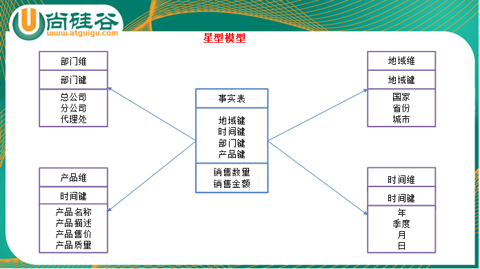

## 第 1 章 Hive 基本概念

### 什么是 Hive

Hive：由 Facebook 开源用于解决海量结构化日志的数据统计。

Hive 是基于 Hadoop 的一个数据仓库工具，可以将结构化的数据文件映射为一张表，并提供类 SQL 查询功能。

本质是：将 HQL 转化成MapReduce 程序

1.  Hive 处理的数据存储在 HDFS
2.  Hive 分析数据底层的默认实现是 MapReduce 
3.  执行程序运行在 Yarn 上


### Hive 的优缺点

1.  优点

    1.  操作接口采用类 SQL 语法，提供快速开发的能力（简单、容易上手）。

    2.  避免了去写 MapReduce，减少开发人员的学习成本。

    3.  Hive 的执行延迟比较高，因此Hive 常用于数据分析，对实时性要求不高的场合。

    4.  Hive 优势在于处理大数据，对于处理小数据没有优势，因为Hive 的执行延迟比较高。

    5.  Hive 支持用户自定义函数，用户可以根据自己的需求来实现自己的函数。

2. 缺点

    1. Hive 的 HQL 表达能力有限

       1.  迭代式算法无法表达
       2.  数据挖掘方面不擅长

    2. Hive 的效率比较低

       ​			1.Hive 自动生成的 MapReduce 作业，通常情况下不够智能化

       ​			2.Hive 调优比较困难，粒度较粗

### Hive 架构原理


Hive 通过给用户提供的一系列交互接口，接收到用户的指令(SQL)，使用自己的 Driver， 结合元数据(MetaStore)，将这些指令翻译成MapReduce，提交到Hadoop 中执行，最后，将执行返回的结果输出到用户交互接口。

#### 用户接口：Client

CLI（hive shell）、JDBC/ODBC(java 访问 hive)、WEBUI（浏览器访问 hive）

#### 元数据：Metastore

元数据包括：表名、表所属的数据库（默认是default）、表的拥有者、列/分区字段、表的类型（是否是外部表）、表的数据所在目录等；

默认存储在自带的 derby 数据库中，推荐使用 MySQL 存储 Metastore

#### Hadoop

使用HDFS 进行存储，使用 MapReduce 进行计算。

#### 驱动器：Driver

1.  解析器（SQL Parser）：将 SQL 字符串转换成抽象语法树 AST，这一步一般都用第三方工具库完成，比如 antlr；对 AST 进行语法分析，比如表是否存在、字段是否存在、SQL 语义是否有误。

2.  编译器（Physical Plan）：将AST 编译生成逻辑执行计划。

3.  优化器（Query Optimizer）：对逻辑执行计划进行优化。

4.  执行器（Execution）：把逻辑执行计划转换成可以运行的物理计划。对于 Hive 来说，就是 MR/Spark。


### Hive 和数据库比较

#### 查询语言

由于 SQL 被广泛的应用在数据仓库中，因此，专门针对 Hive 的特性设计了类 SQL 的查询语言HQL。熟悉 SQL 开发的开发者可以很方便的使用 Hive 进行开发。

#### 数据存储位置

Hive 是建立在 Hadoop 之上的，所有 Hive 的数据都是存储在 HDFS 中的。而数据库则可以将数据保存在块设备或者本地文件系统中。

#### 数据更新

由于 Hive 是针对数据仓库应用设计的，而数据仓库的内容是读多写少的。因此，Hive 中不建议对数据的改写，所有的数据都是在加载的时候确定好的。而数据库中的数据通常是需要 经常进行 修改的， 因 此可以使 用 INSERT INTO ... VALUES 添加数 据， 使用 UPDATE ... SET 修改数据。

#### 索引

Hive 在加载数据的过程中不会对数据进行任何处理，甚至不会对数据进行扫描，因此也没有对数据中的某些 Key 建立索引。Hive 要访问数据中满足条件的特定值时，需要暴力扫描整个数据，因此访问延迟较高。由于MapReduce 的引入， Hive 可以并行访问数据，因此即使没有索引，对于大数据量的访问，Hive 仍然可以体现出优势。数据库中，通常会针对一个或者几个列建立索引，因此对于少量的特定条件的数据的访问，数据库可以有很高的效率，较低的延迟。由于数据的访问延迟较高，决定了Hive 不适合在线数据查询。

#### 执行

Hive 中大多数查询的执行是通过 Hadoop 提供的 MapReduce 来实现的。而数据库通常有自己的执行引擎。

#### 执行延迟

Hive 在查询数据的时候，由于没有索引，需要扫描整个表，因此延迟较高。另外一个导致Hive 执行延迟高的因素是 MapReduce 框架。由于 MapReduce 本身具有较高的延迟， 因此在利用MapReduce 执行 Hive 查询时，也会有较高的延迟。相对的，数据库的执行延迟较低。当然，这个低是有条件的，即数据规模较小，当数据规模大到超过数据库的处理能力的时候，Hive 的并行计算显然能体现出优势。

#### 可扩展性

由于 Hive 是建立在 Hadoop 之上的，因此 Hive 的可扩展性是和 Hadoop 的可扩展性是一致的（世界上最大的 Hadoop 集群在 Yahoo!，2009 年的规模在 4000 台节点左右）。而数据库由于ACID 语义的严格限制，扩展行非常有限。目前最先进的并行数据库 Oracle在理论上的扩展能力也只有 100 台左右。

#### 数据规模

由于Hive 建立在集群上并可以利用 MapReduce 进行并行计算，因此可以支持很大规模的数据；对应的，数据库可以支持的数据规模较小。


## 第 2 章 Hive 数据类型

### 基本数据类型

| Hive数据类型 | Java数据类型 | 长度                                                 | 例子                                 |
| ------------ | ------------ | ---------------------------------------------------- | ------------------------------------ |
| TINYINT      | byte         | 1byte有符号整数                                      | 20                                   |
| SMALINT      | short        | 2byte有符号整数                                      | 20                                   |
| INT          | int          | 4byte有符号整数                                      | 20                                   |
| BIGINT       | long         | 8byte有符号整数                                      | 20                                   |
| BOOLEAN      | boolean      | 布尔类型，true或者false                              | TRUE  FALSE                          |
| FLOAT        | float        | 单精度浮点数                                         | 3.14159                              |
| DOUBLE       | double       | 双精度浮点数                                         | 3.14159                              |
| STRING       | string       | 字符系列。可以指定字符集。可以使用单引号或者双引号。 | ‘now is the time’ “for all good men” |
| TIMESTAMP    |              | 时间类型                                             |                                      |
| BINARY       |              | 字节数组                                             |                                      |

对于Hive 的 String 类型相当于数据库的 varchar 类型，该类型是一个可变的字符串，不过它不能声明其中最多能存储多少个字符，理论上它可以存储 2GB 的字符数。

### 集合数据类型

| 数据类型 | 描述                                                         | 语法示例 |
| -------- | ------------------------------------------------------------ | -------- |
| STRUCT   | 和c语言中的struct类似，都可以通过“点”符号访问元素内容。例如，如果某个列的数据类型是STRUCT{first STRING, last STRING},那么第1个元素可以通过字段.first来引用。 | struct() |
| MAP      | MAP是一组键-值对元组集合，使用数组表示法可以访问数据。例如，如果某个列的数据类型是MAP，其中键->值对是’first’->’John’和’last’->’Doe’，那么可以通过字段名[‘last’]获取最后一个元素 | map()    |
| ARRAY    | 数组是一组具有相同类型和名称的变量的集合。这些变量称为数组的元素，每个数组元素都有一个编号，编号从零开始。例如，数组值为[‘John’, ‘Doe’]，那么第2个元素可以通过数组名[1]进行引用。 | Array()  |

Hive 有三种复杂数据类型ARRAY、MAP 和 STRUCT。ARRAY 和 MAP 与Java 中的Array 和 Map 类似，而STRUCT 与C 语言中的 Struct 类似，它封装了一个命名字段集合， 复杂数据类型允许任意层次的嵌套。

### 案例实操

案例实操

1）假设某表有如下一行，我们用JSON格式来表示其数据结构。在Hive下访问的格式为

```
{
    "name": "songsong",
    "friends": ["bingbing" , "lili"] ,       //列表Array, 
    "children": {                      //键值Map,
        "xiao song": 18 ,
        "xiaoxiao song": 19
    }
    "address": {                      //结构Struct,
        "street": "hui long guan" ,
        "city": "beijing" 
    }
}
```


2）基于上述数据结构，我们在Hive里创建对应的表，并导入数据。 

创建本地测试文件test.txt

```
songsong,bingbing_lili,xiao song:18_xiaoxiao song:19,hui long guan_beijing
yangyang,caicai_susu,xiao yang:18_xiaoxiao yang:19,chao yang_beijing
```

注意，MAP，STRUCT和ARRAY里的元素间关系都可以用同一个字符表示，这里用“_”。

3）Hive上创建测试表test

```
create table test(
name string,
friends array<string>,
children map<string, int>,
address struct<street:string, city:string>
)
row format delimited fields terminated by ','
collection items terminated by '_'
map keys terminated by ':'
lines terminated by '\n';

字段解释：
row format delimited fields terminated by ','  -- 列分隔符
collection items terminated by '_'  --MAP STRUCT 和 ARRAY 的分隔符(数据分割符号)
map keys terminated by ':'				-- MAP中的key与value的分隔符
lines terminated by '\n';					-- 行分隔符
```

4）导入文本数据到测试表

hive (default)> load data local inpath '/opt/module/datas/test.txt' into table test;

5）访问三种集合列里的数据，以下分别是ARRAY，MAP，STRUCT的访问方式

```
select friends[1],children['xiao song'],address.city from test where name="songsong";
```


### 类型转化

Hive 的原子数据类型是可以进行隐式转换的，类似于Java 的类型转换，例如某表达式使用 INT 类型，TINYINT 会自动转换为 INT 类型，但是Hive 不会进行反向转化，例如， 某表达式使用TINYINT 类型，INT 不会自动转换为 TINYINT 类型，它会返回错误，除非使用 CAST 操作。

1.  #### 隐式类型转换规则如下

    1.  任何整数类型都可以隐式地转换为一个范围更广的类型，如 TINYINT 可以转换成 INT，INT 可以转换成BIGINT。

    2.  所有整数类型、FLOAT 和 STRING 类型都可以隐式地转换成 DOUBLE。

    3.  TINYINT、SMALLINT、INT 都可以转换为 FLOAT。

    4.  BOOLEAN 类型不可以转换为任何其它的类型。

2. #### 可以使用 CAST 操作显示进行数据类型转换

    例如CAST(\'1\' AS INT)将把字符串\'1\' 转换成整数 1；如果强制类型转换失败，如执行CAST(\'X\' AS INT)，表达式返回空值 NULL。

## 第 3 章 DDL 数据定义

### 创建数据库

1.  创建一个数据库，数据库在HDFS 上的默认存储路径是/user/hive/warehouse/\*.db。

> hive (default)\> create database db\_hive;

2.  避免要创建的数据库已经存在错误，增加 if not exists 判断。（标准写法）

3.  创建一个数据库，指定数据库在 HDFS 上存放的位置

> hive (default)\> create database db\_hive2 location \'/db\_hive2.db\';
>

### 查询数据库

1. 显示数据库

    hive\> show databases;

2. 过滤显示查询的数据库

   show databases like 'db_hive*';

3. 查看数据库详情

     desc database [extended] db_hive;

4. 切换当前数据库

   use db_hive;

### 修改数据库

用户可以使用 ALTER DATABASE 命令为某个数据库的 DBPROPERTIES 设置键-值对属性值，来描述这个数据库的属性信息。数据库的其他元数据信息都是不可更改的，包括数据库名和数据库所在的目录位置。

alter database db_hive set dbproperties('createtime'='20170830');

### 删除数据库

1.  删除空数据库

2. 如果删除的数据库不存在，最好采用 if exists 判断数据库是否存在

    drop database if exists db_hive2;

3. 如果数据库不为空，可以采用 cascade 命令，强制删除

    drop database db_hive cascade;

### 创建表

1. 建表语法

   ```
   CREATE [EXTERNAL] TABLE [IF NOT EXISTS] table_name 
   [(col_name data_type [COMMENT col_comment], ...)] 
   [COMMENT table_comment] 
   [PARTITIONED BY (col_name data_type [COMMENT col_comment], ...)] 
   [CLUSTERED BY (col_name, col_name, ...) 
   [SORTED BY (col_name [ASC|DESC], ...)] INTO num_buckets BUCKETS] 
   [ROW FORMAT row_format] 
   [STORED AS file_format] 
   [LOCATION hdfs_path]
   ```

2. 字段解释说明

   1. CREATE TABLE 创建一个指定名字的表。如果相同名字的表已经存在，则抛出异常；用户可以用 IF NOT EXISTS 选项来忽略这个异常。

   2. EXTERNAL 关键字可以让用户创建一个外部表，在建表的同时指定一个指向实际数据的路径（LOCATION），Hive 创建内部表时，会将数据移动到数据仓库指向的路径；若创建外部表，仅记录数据所在的路径，不对数据的位置做任何改变。在删除表的时候，内部表的元数据和数据会被一起删除，而外部表只删除元数据，不删除数据。

   3. COMMENT：为表和列添加注释。

   4. PARTITIONED BY 创建分区表

   5. CLUSTERED BY 创建分桶表

   6. SORTED BY 不常用

   7. ROW FORMAT

      ​	DELIMITED

      ​    \[FIELDS TERMINATED BY char\] 

      ​	[COLLECTION ITEMS TERMINATED BY char\]

      ​	[MAP KEYS TERMINATED BY char\] 

      ​	[LINES TERMINATED BY char\]

      ​	| SERDE serde\_name \[WITH SERDEPROPERTIES (property\_name=property\_value, 	

      ​	property\_name=property\_value, \...)\]

      用户在建表的时候可以自定义 SerDe 或者使用自带的 SerDe。如果没有指定 ROW FORMAT 或者 ROW FORMAT DELIMITED，将会使用自带的 SerDe。在建表的时候，用户还需要为表指定列，用户在指定表的列的同时也会指定自定义的 SerDe，Hive 通过 SerDe 确定表的具体的列的数据。

      SerDe 是 Serialize/Deserilize 的简称，目的是用于序列化和反序列化。

   8. STORED AS 指定存储文件类型

      常用的存储文件类型：SEQUENCEFILE（二进制序列文件）、TEXTFILE（文本）、

      RCFILE（列式存储格式文件）

      如果文件数据是纯文本，可以使用 STORED AS TEXTFILE。如果数据需要压缩， 使用 STORED AS SEQUENCEFILE。

   9. LOCATION ：指定表在HDFS 上的存储位置。

   10. LIKE 允许用户复制现有的表结构，但是不复制数据。

      

#### 管理表

默认创建的表都是所谓的管理表，有时也被称为内部表。因为这种表，Hive 会（或多或少地）控制着数据的生命周期。Hive 默认情况下会将这些表的数据存储在由配置项hive.metastore.warehouse.dir(例如，/user/hive/warehouse)所定义的目录的子目录下。当我们删除一个管理表时，Hive 也会删除这个表中数据。管理表不适合和其他工具共享数据。

##### 案例实操

1. 普通创建表

   ```
   create table if not exists student2(
   id int, name string
   )
   row format delimited fields terminated by '\t'
   stored as textfile
   location '/user/hive/warehouse/student2';
   ```

2. 根据查询结果创建表（查询的结果会添加到新创建的表中）

   ```
   create table if not exists student3
   as select id, name from student;
   ```

3. 根据已经存在的表结构创建表

   ```
   create table if not exists student4 like student;
   ```

4. 查询表的类型

    ```
    hive (default)> desc formatted student2;
    Table Type: MANAGED_TABLE 
    ```

#### 外部表

因为表是外部表，所以 Hive 并非认为其完全拥有这份数据。删除该表并不会删除掉这份数据，不过描述表的元数据信息会被删除掉。

##### 案例实操

分别创建部门和员工外部表，并向表中导入数据。

1. 原始数据

   ```
   dept.txt
   10	ACCOUNTING	1700
   20	RESEARCH	1800
   30	SALES	1900
   40	OPERATIONS	1700
   emp.txt
   7369	SMITH	CLERK	7902	1980-12-17	800.00		20
   7499	ALLEN	SALESMAN	7698	1981-2-20	1600.00	300.00	30
   7521	WARD	SALESMAN	7698	1981-2-22	1250.00	500.00	30
   7566	JONES	MANAGER	7839	1981-4-2	2975.00		20
   7654	MARTIN	SALESMAN	7698	1981-9-28	1250.00	1400.00	30
   7698	BLAKE	MANAGER	7839	1981-5-1	2850.00		30
   7782	CLARK	MANAGER	7839	1981-6-9	2450.00		10
   7788	SCOTT	ANALYST	7566	1987-4-19	3000.00		20
   7839	KING	PRESIDENT		1981-11-17	5000.00		10
   7844	TURNER	SALESMAN	7698	1981-9-8	1500.00	0.00	30
   7876	ADAMS	CLERK	7788	1987-5-23	1100.00		20
   7900	JAMES	CLERK	7698	1981-12-3	950.00		30
   7902	FORD	ANALYST	7566	1981-12-3	3000.00		20
   7934	MILLER	CLERK	7782	1982-1-23	1300.00		10
   
   ```

   

2. 建表语句

   ```
   create external table if not exists default.dept(
   deptno int,
   dname string,
   loc int
   )
   row format delimited fields terminated by '\t';
   
   
   create external table if not exists default.emp(
   empno int,
   ename string,
   job string,
   mgr int,
   hiredate string, 
   sal double, 
   comm double,
   deptno int)
   row format delimited fields terminated by '\t';
   ```

3. 向外部表中导入数据

   ```
   hive (default)> load data local inpath '/opt/module/datas/dept.txt' into table default.dept;
   hive (default)> load data local inpath '/opt/module/datas/emp.txt' into table default.emp;
   
   ```

4. 查看表格type

   ```
   hive (default)> desc formatted dept;
   Table Type: EXTERNAL_TABLE
   ```

   

#### 管理表和外部表的使用场景

每天将收集到的网站日志定期流入HDFS 文本文件。在外部表（原始日志表）的基础上做大量的统计分析，用到的中间表、结果表使用内部表存储，数据通过 SELECT+INSERT 进入内部表。


#### 管理表与外部表的互相转换

1. 修改内部表 student2 为外部表

   ```
   alter table student2 set tblproperties('EXTERNAL'='TRUE');
   ```

2. 修改外部表 student2 为内部表

   ```
   alter table student2 set tblproperties('EXTERNAL'='FALSE');
   ```

> 注意：(\'EXTERNAL\'=\'TRUE\')和(\'EXTERNAL\'=\'FALSE\')为固定写法，区分大小写！

### 分区表

分区表实际上就是对应一个 HDFS 文件系统上的独立的文件夹，该文件夹下是该分区所有的数据文件。Hive 中的分区就是分目录，把一个大的数据集根据业务需要分割成小的数据集。在查询时通过 WHERE 子句中的表达式选择查询所需要的指定的分区，这样的查询效率会提高很多。

#### 分区表基本操作

##### 创建分区表语法

```
create table dept_partition(
deptno int, dname string, loc string
)
partitioned by (month string)
row format delimited fields terminated by '\t';

```

##### 加载数据到分区表中

```
hive (default)> load data local inpath '/opt/module/datas/dept.txt' into table default.dept_partition partition(month='201709');
hive (default)> load data local inpath '/opt/module/datas/dept.txt' into table default.dept_partition partition(month='201708');
hive (default)> load data local inpath '/opt/module/datas/dept.txt' into table default.dept_partition partition(month='201707');
```


##### 查询分区表中数据

```
hive (default)> select * from dept_partition where month='201709';
hive (default)> select * from dept_partition where month='201709'
union
select * from dept_partition where month='201708'
union
select * from dept_partition where month='201707';

```

##### 增加分区

```
hive (default)> alter table dept_partition add partition(month='201706') ;
hive (default)> alter table dept_partition add partition(month='201705') partition(month='201704');
```

##### 删除分区

```
hive (default)> alter table dept_partition drop partition (month='201704');
hive (default)> alter table dept_partition drop partition (month='201705'), partition (month='201706');
```

##### 查看分区表有多少分区

```
show partitions dept_partition;
```

##### 查看分区表结构

```
hive>desc formatted dept_partition;
# Partition Information 
# col_name data_type comment 
month string 
```

#### **分区表注意事项**

1. 创建二级分区表

   ```
   hive (default)> create table dept_partition2(
   deptno int, dname string, loc string
   )
   partitioned by (month string, day string)
   row format delimited fields terminated by '\t';
   
   ```

2. 把数据直接上传到分区目录上，让分区表和数据产生关联的三种方式
   1. 方式一：上传数据后修复

      ```
      hive (default)> dfs -mkdir -p /user/hive/warehouse/dept_partition2/month=201709/day=12;
      hive (default)> dfs -put /opt/module/datas/dept.txt /user/hive/warehouse/dept_partition2/month=201709/day=12;
      
      hive>msck repair table dept_partition2;
      ```

   2. 方式二：上传数据后添加分区

      ```
      hive (default)> dfs -mkdir -p /user/hive/warehouse/dept_partition2/month=201709/day=11;
      hive (default)> dfs -put /opt/module/datas/dept.txt /user/hive/warehouse/dept_partition2/month=201709/day=11;
      
      
      hive (default)> alter table dept_partition2 add partition(month='201709', day='11');
      ```

   3. 方式三：创建文件夹后 load 数据到分区创建目录

      ```
      hive (default)> dfs -mkdir -p /user/hive/warehouse/dept_partition2/month=201709/day=10;
      
      hive (default)> load data local inpath '/opt/module/datas/dept.txt' into table dept_partition2 partition(month='201709',day='10');
      
      ```

      

### 修改表

#### 重命名表

ALTER TABLE table_name RENAME TO new_table_name

#### 增加/修改/替换列信息

```
更新列
ALTER TABLE table_name CHANGE [COLUMN] col_old_name col_new_name column_type [COMMENT col_comment] [FIRST|AFTER column_name]

增加和替换列
ALTER TABLE table_name ADD|REPLACE COLUMNS (col_name data_type [COMMENT col_comment], ...) 

注：ADD是代表新增一字段，字段位置在所有列后面(partition列前)，REPLACE则是表示替换表中所有字段。
```

#### 实操案例

```
hive (default)> alter table dept_partition add columns(deptdesc string);

hive (default)> alter table dept_partition change column deptdesc desc int;

hive (default)> alter table dept_partition replace columns(deptno string, dname string, loc string);

```


### 删除表

drop table ... ;

## **第 4 章 DML 数据操作**

### 数据导入

1. **向表中装载数据（Load）**

    ```
    hive>load data [local] inpath '/opt/module/datas/student.txt' [overwrite] into table student [partition (partcol1=val1,…)];
    （1）load data:表示加载数据
    （2）local:表示从本地加载数据到hive表；否则从HDFS加载数据到hive表
    （3）inpath:表示加载数据的路径
    （4）overwrite:表示覆盖表中已有数据，否则表示追加
    （5）into table:表示加载到哪张表
    （6）student:表示具体的表
    （7）partition:表示上传到指定分区
    
    
    案例
    hive (default)> create table student(id string, name string) row format delimited fields terminated by '\t';
    
    hive (default)> load data local inpath '/opt/module/datas/student.txt' into table default.student;
    
    上传文件到HDFS
    hive (default)> dfs -put /opt/module/datas/student.txt /user/atguigu/hive;
    加载HDFS上数据
    hive (default)>load data inpath '/user/atguigu/hive/student.txt' into table default.student;
    
    上传文件到HDFS
    hive (default)> dfs -put /opt/module/datas/student.txt /user/atguigu/hive;
    加载数据覆盖表中已有的数据
    hive (default)>load data inpath '/user/atguigu/hive/student.txt' overwrite into table default.student;
    ```

    

2. **通过查询语句向表中插入数据（Insert）**

    ```
    hive (default)> create table student(id int, name string) partitioned by (month string) row format delimited fields terminated by '\t';
    
    hive (default)> insert into table student partition(month='201709') values(1,'wangwu');
    
    hive (default)> insert overwrite table student partition(month='201708')
    select id, name from student where month='201709';
    
    hive (default)> from student
    insert overwrite table student partition(month='201707')
    select id, name where month='201709'
    insert overwrite table student partition(month='201706')
    select id, name where month='201709';
    ```

    

3. **查询语句中创建表并加载数据（As Select）**

    ```
    create table if not exists student3
    as select id, name from student;
    ```

    

4. **创建表时通过 Location 指定加载数据路径**

    ```
    hive (default)> create table if not exists student5(
    id int, name string
    )
    row format delimited fields terminated by '\t'
    location '/user/hive/warehouse/student5';
    
    hive (default)> dfs -put /opt/module/datas/student.txt /user/hive/warehouse/student5;
    
    ```

    

5. **Import 数据到指定 Hive 表中**

   ```
   hive (default)> import table student2 partition(month='201709') from '/user/hive/warehouse/export/student';
   ```

> 注意：先用 export 导出后，再将数据导入。

### 数据导出

1. **Insert 导出**
   1. 将查询的结果导出到本地

      hive (default)> insert overwrite local directory '/opt/module/datas/export/student' select * from student;

   2. 将查询的结果格式化导出到本地

      hive (default)> insert overwrite local directory '/opt/module/datas/export/student1'
      ROW FORMAT DELIMITED FIELDS TERMINATED BY '\t'
      select * from student;

   3. 将查询的结果导出到HDFS 上(没有 local)

      hive (default)> insert overwrite directory '/user/atguigu/student2'
      ROW FORMAT DELIMITED FIELDS TERMINATED BY '\t'
      select * from student;

2. **Hadoop 命令导出到本地**

   hive (default)> dfs -get /user/hive/warehouse/student/month=201709/000000_0 /opt/module/datas/export/student3.txt;

3. **Hive Shell 命令导出**

   [hadoop102 hive]$ bin/hive -e 'select * from default.student;' >> /opt/module/datas/export/student4.txt;

4. **Export 导出到 HDFS 上**

   hive (default)> export table default.student to '/user/hive/warehouse/export/student';

5. **Sqoop 导出**


### 清除表中数据（Truncate）

注意：Truncate 只能删除管理表，不能删除外部表中数据

hive (default)\> truncate table student;

## 第 5 章 查 询

### 算术运算符


### having 与 where 不同点

1.  where 针对表中的列发挥作用，查询数据；having 针对查询结果中的列发挥作用， 筛选数据。

2.  where 后面不能写聚合函数，而 having 后面可以使用聚合函数。

3. having 只用于 group by 分组统计语句。

    hive (default)> select deptno, avg(sal) avg_sal from emp group by deptno having avg_sal > 2000;

    

### Join 语句

#### 等值 Join

Hive 支持通常的 SQL JOIN 语句，但是只支持等值连接，不支持非等值连接。案例实操

hive (default)> select e.empno, e.ename, d.deptno, d.dname from emp e join dept d on e.deptno = d.deptno;

#### 内连接

内连接：只有进行连接的两个表中都存在与连接条件相匹配的数据才会被保留下来。

hive (default)> select e.empno, e.ename, d.deptno from emp e join dept d on e.deptno = d.deptno;

#### 左外连接

左外连接：JOIN 操作符左边表中符合WHERE 子句的所有记录将会被返回。

hive (default)> select e.empno, e.ename, d.deptno from emp e left join dept d on e.deptno = d.deptno;

#### 右外连接

右外连接：JOIN 操作符右边表中符合WHERE 子句的所有记录将会被返回。

hive (default)> select e.empno, e.ename, d.deptno from emp e right join dept d on e.deptno = d.deptno;

#### 满外连接

满外连接：将会返回所有表中符合 WHERE 语句条件的所有记录。如果任一表的指定字段没有符合条件的值的话，那么就使用 NULL 值替代。

hive (default)> select e.empno, e.ename, d.deptno from emp e full join dept d on e.deptno = d.deptno;

#### 多表连接

hive (default)>SELECT e.ename, d.deptno, l. loc_name
FROM emp e 
JOIN dept d
ON d.deptno = e.deptno 
JOIN location l
ON d.loc = l.loc;

大多数情况下，Hive会对每对JOIN连接对象启动一个MapReduce任务。

本例中会首先启动一个MapReduce job对表e和表d进行连接操作，然后会再启动一个MapReduce job将第一个MapReduce job的输出和表l进行连接操作。

注意：为什么不是表d和表l先进行连接操作呢？这是因为Hive总是按照从左到右的顺序执行的。

#### 笛卡尔积

hive (default)> select e.empno, d.dname from emp e, dept d;

笛卡尔集会在下面条件下产生

1.  省略连接条件

2.  连接条件无效

3. 所有表中的所有行互相连接

    

### 排序

#### Order By：全局排序，一个 Reducer

ASC（ascend）: 升序（默认）, DESC（descend）: 降序

#### 每个 MapReduce 内部排序（Sort By）

Sort By：每个 Reducer 内部进行排序，对全局结果集来说不是排序。

1. 设置reduce 个数

   hive (default)> set mapreduce.job.reduces=3;

2. 查看设置 reduce 个数

   hive (default)> set mapreduce.job.reduces;

3. 根据部门编号降序查看员工信息

   hive (default)> insert overwrite local directory '/opt/module/datas/sortby' select * from emp sort by deptno desc;

#### 分区排序

Distribute By：类似 MR 中 partition，进行分区，结合 sort by 使用。注意，Hive 要求 DISTRIBUTE BY 语句要写在SORT BY 语句之前。

对于 distribute by 进行测试，一定要分配多 reduce 进行处理，否则无法看到 distribute by的效果。 

案例实操：

先按照部门编号分区，再按照员工编号降序排序。

hive (default)> insert overwrite local directory '/opt/module/datas/distby-desc' select * from emp distribute by deptno sort by empno desc;

#### Cluster By

当 distribute by 和 sorts by 字段相同时，可以使用 cluster by 方式。

cluster by 除了具有 distribute by 的功能外还兼具 sort by 的功能。但是排序只能是升序排序，不能指定排序规则为 ASC 或者 DESC。

以下两种写法等价

select * from emp cluster by deptno;

select * from emp distribute by deptno sort by deptno;

> 注意：按照部门编号分区，不一定就是固定死的数值，可以是 20 号和 30 号部门分到一个分区里面去。

### 分桶及抽样查询

#### **分桶表数据存储**

分区针对的是数据的存储路径；分桶针对的是数据文件。

分区提供一个隔离数据和优化查询的便利方式。不过，并非所有的数据集都可形成合理的分区，特别是之前所提到过的要确定合适的划分大小这个疑虑。

分桶是将数据集分解成更容易管理的若干部分的另一个技术。

```
create table stu_buck(id int, name string)
clustered by(id) 
into 4 buckets
row format delimited fields terminated by '\t';

create table stu(id int, name string)
row format delimited fields terminated by '\t';


hive (default)> desc formatted stu_buck;
Num Buckets: 4 

hive (default)> load data local inpath '/opt/module/datas/student.txt' into table stu;

hive (default)>set hive.enforce.bucketing=true;
hive (default)> set mapreduce.job.reduces=-1;
hive (default)>insert into table stu_buck
select id, name from stu;

```


#### 分桶抽样查询

对于非常大的数据集，有时用户需要使用的是一个具有代表性的查询结果而不是全部结果。Hive可以通过对表进行抽样来满足这个需求。

查询表stu_buck的数据。

hive (default)> select * from stu_buck TABLESAMPLE(bucket 1 out of 4 on id);

注：tablesample是抽样语句，语法：TABLESAMPLE(BUCKET x OUT OF y) 。

y必须是table总bucket数的倍数或者因子。

hive根据y的大小，决定抽样的比例。例如，table总共分了4份，当y=2时，抽取(4/2=)2个bucket的数据，当y=8时，抽取(4/8=)1/2个bucket的数据。

x表示从哪个bucket开始抽取，如果需要取多个分区，以后的分区号为当前分区号加上y。例如，table总bucket数为4，tablesample(bucket 1 out of 2)，表示总共抽取（4/2=）2个bucket的数据，抽取第1(x)个和第4(x+y)个bucket的数据。
注意：x的值必须小于等于y的值，否则
FAILED: SemanticException [Error 10061]: Numerator should not be bigger than denominator in sample clause for table stu_buck

#### 数据块抽样

Hive提供了另外一种按照百分比进行抽样的方式，这种事基于行数的，按照输入路径下的数据块百分比进行的抽样。

select * from stu tablesample(0.1 percent);

提示：这种抽样方式不一定适用于所有的文件格式。另外，这种抽样的最小抽样单元是一个HDFS数据块。因此，如果表的数据大小小于普通的块大小128M的话，那么将会返回所有行。

### 其他常用查询函数

#### 空字段赋值

1.  函数说明

> NVL：给值为 NULL 的数据赋值，它的格式是 NVL( string1, replace\_with)。它的功能是如果string1 为 NULL，则 NVL 函数返回 replace\_with 的值，否则返回 string1 的值，如果两个参数都为 NULL ，则返回NULL。

```
select nvl(comm,-1) from emp; 
select nvl(comm,mgr) from emp; 
```

#### 时间类

1. date\_format:格式化时间

     select date_format('2019-06-29','yyyy-MM-dd'); 

2. date\_add:时间跟天数相加

    ```
    hive (default)> select date_add('2019-06-29',5); 
    OK
    _c0
    2019-07-04
    
    hive (default)> select date_add('2019-06-29',-5); 
    OK
    _c0
    2019-06-24
    ```

3. date\_sub:时间跟天数相减

    ```
    hive (default)> select date_sub('2019-06-29',5); 
    OK
    _c0
    2019-06-24
    
    hive (default)> select date_sub('2019-06-29 12:12:12',5); 
    OK
    _c0
    2019-06-24
    
    hive (default)> select date_sub('2019-06-29',-5); 
    OK
    _c0
    2019-07-04
    ```

    

4. datediff:两个时间相减

    ```
    hive (default)> select datediff('2019-06-29','2019-06-24'); 
    OK
    _c0 5
    
    hive (default)> select datediff('2019-06-24 12:12:12','2019-06-29'); 
    OK
    _c0
    -5
    
    hive (default)> select datediff('2019-06-24 12:12:12','2019-06-29 13:13:13');
    OK
    _c0
    -5
    ```

    

#### case when

emp.txt

| name | dept_id | sex  |
| ---- | ------- | ---- |
| 悟空 | A       | 男   |
| 大海 | A       | 男   |
| 宋宋 | B       | 男   |
| 凤姐 | A       | 女   |
| 婷姐 | B       | 女   |
| 婷婷 | B       | 女   |

```
create table emp_sex( name string,
dept_id string, sex string)
row format delimited fields terminated by "\t";

load data local inpath '/opt/module/data/emp_sex.txt' into table emp_sex;

select dept_id,
sum(case sex when '男' then 1 else 0 end) male_count, 
sum(case sex when '女' then 1 else 0 end) female_count
from
emp_sex 
group by
dept_id;
```

### 行转列

1.  相关函数说明

> CONCAT(string A/col, string B/col...)：返回输入字符串连接后的结果，支持任意个输入字符串;
>
> CONCAT\_WS(separator, str1, str2,\...)：它是一个特殊形式的 CONCAT()。第一个参数剩余参数间的分隔符。分隔符可以是与剩余参数一样的字符串。如果分隔符是 NULL， 返回值也将为 NULL。这个函数会跳过分隔符参数后的任何 NULL 和空字符串。分隔符将被加到被连接的字符串之间;
>
> COLLECT\_SET(col)：函数只接受基本数据类型，它的主要作用是将某字段的值进行去重汇总，产生 array 类型字段。

2.  数据准备

```
孙悟空 白羊座 A
大海 射手座 A
宋宋 白羊座 B
猪八戒 白羊座 A
凤姐 射手座 A
```

3.  需求

把星座和血型一样的人归类到一起。结果如下：

```
射手座,A 大海|凤姐
白羊座,A 孙悟空|猪八戒
白羊座,B 宋宋
```

4. 创建 hive 表并导入数据

```
create table person_info(
name string, 
constellation string, 
blood_type string) 
row format delimited fields terminated by "\t";
load data local inpath “/opt/module/datas/person_info.txt” into table person_info;

```

5. 按需求查询

```
select
t1.base,
concat_ws('|', collect_set(t1.name)) name
from
(select
name,
concat(constellation, ",", blood_type) base
from
person_info) t1
group by
t1.base;
```


### 列转行

1.  函数说明

> EXPLODE(col)：将hive 一列中复杂的 array 或者 map 结构拆分成多行。
>
> LATERAL VIEW
>
> 用法：LATERAL VIEW udtf(expression) tableAlias AS columnAlias
>
> 解释：用于和 split, explode 等UDTF 一起使用，它能够将一列数据拆成多行数据，在此基础上可以对拆分后的数据进行聚合。

2.  数据准备

```
《疑犯追踪》 悬疑,动作,科幻,剧情
《Lie to me》 悬疑,警匪,动作,心理,剧情
《战狼2》 战争,动作,灾难
```

3. 需求

   将电影分类中的数组数据展开。结果如下：

```
《疑犯追踪》 悬疑
《疑犯追踪》 动作
《疑犯追踪》 科幻
《疑犯追踪》 剧情
《Lie to me》 悬疑
《Lie to me》 警匪
《Lie to me》 动作
《Lie to me》 心理
《Lie to me》 剧情
《战狼2》 战争
《战狼2》 动作
《战狼2》 灾难
```

4. 创建 hive 表并导入数据

```
create table movie_info(
movie string, 
category array<string>) 
row format delimited fields terminated by "\t"
collection items terminated by ",";
load data local inpath "/opt/module/datas/movie.txt" into table movie_info;
```

5. 按需求查询数据

```
select
movie,
category_name 
from 
movie_info lateral view explode(category) table_tmp as category_name;
```


### 窗口函数

#### OVER()

指定分析函数工作的数据窗口大小，这个数据窗口大小可能会随着行的变化而变化；

CURRENT ROW：当前行；

n PRECEDING：往前 n 行数据；

n FOLLOWING：往后 n 行数据；

UNBOUNDED：起点，UNBOUNDED PRECEDING 表示从前面的起点，UNBOUNDED

FOLLOWING 表示到后面的终点； 

#### LAG(col,n)

往前第n 行数据； 

#### LEAD(col,n)

往后第 n 行数据；

#### NTILE(n)

把有序分区中的行分发到指定数据的组中，各个组有编号，编号从 1 开始， 对于每一行，NTILE 返回此行所属的组的编号。注意：n 必须为 int 类型。

#### Rank

RANK() 排序相同时会重复，总数不会变

#### DENSE\_RANK() 

排序相同时会重复，总数会减少

#### ROW\_NUMBER() 

会根据顺序计算

#### 案例

##### 数据准备

```
jack,2017-01-01,10
tony,2017-01-02,15
jack,2017-02-03,23
tony,2017-01-04,29
jack,2017-01-05,46
jack,2017-04-06,42
tony,2017-01-07,50
jack,2017-01-08,55
mart,2017-04-08,62
mart,2017-04-09,68
neil,2017-05-10,12
mart,2017-04-11,75
neil,2017-06-12,80
mart,2017-04-13,94

create table business(
name string, 
orderdate string,
cost int
) ROW FORMAT DELIMITED FIELDS TERMINATED BY ',';
load data local inpath "/opt/module/datas/business.txt" into table business;
```

##### 需求

1.  查询在 2017 年 4 月份购买过的顾客及总人数

```
select name,count(*) over () 
from business 
where substring(orderdate,1,7) = '2015-04' 
group by name;
```

2.  查询顾客的购买明细及月购买总额

```
select 
name,orderdate,cost,
sum(cost) over(partition by month(orderdate)) 
from business;
```

3. 上述的场景,要将 cost 按照日期进行累加

```
select name,orderdate,cost, 
sum(cost) over() as sample1,--所有行相加 
sum(cost) over(partition by name) as sample2,--按name分组，组内数据相加 
sum(cost) over(partition by name order by orderdate) as sample3,--按name分组，组内数据累加 
sum(cost) over(partition by name order by orderdate rows between UNBOUNDED PRECEDING and current row ) as sample4 ,--和sample3一样,由起点到当前行的聚合 
sum(cost) over(partition by name order by orderdate rows between 1 PRECEDING and current row) as sample5, --当前行和前面一行做聚合 
sum(cost) over(partition by name order by orderdate rows between 1 PRECEDING AND 1 FOLLOWING ) as sample6,--当前行和前边一行及后面一行 
sum(cost) over(partition by name order by orderdate rows between current row and UNBOUNDED FOLLOWING ) as sample7 --当前行及后面所有行 
from business;

```

4. 查询顾客上次的购买时间

```
select name,orderdate,cost, 
lag(orderdate,1,'1900-01-01') over(partition by name order by orderdate ) as time1, lag(orderdate,2) over (partition by name order by orderdate) as time2 
from business;
```

5. 查询前 20%时间的订单信息

```
select * from (
select name,orderdate,cost, 
ntile(5) over(order by orderdate) sorted
from business
) t
where sorted = 1;
```

## 第 6 章 自定义函 数

### 自定义函数

1）根据用户自定义函数类别分为以下三种：

​	（1）UDF（User-Defined-Function）

​		一进一出

​	（2）UDAF（User-Defined Aggregation Function）

​		聚集函数，多进一出

​		类似于：count/max/min

​	（3）UDTF（User-Defined Table-Generating Functions）

​		一进多出

​		如lateral view explore()

2）编程步骤：

​	（1）继承org.apache.hadoop.hive.ql.UDF

​	（2）需要实现evaluate函数；evaluate函数支持重载；

​	（3）在hive的命令行窗口创建函数

​		a）添加jar

​			add jar linux_jar_path

​		b）创建function，

​			create [temporary] function [dbname.]function_name AS class_name;

​	（4）在hive的命令行窗口删除函数

​		Drop [temporary] function [if exists] [dbname.]function_name;

3）注意事项

​	（1）UDF必须要有返回类型，可以返回null，但是返回类型不能为void；

### 自定义UDF函数开发案例

```java
import org.apache.hadoop.hive.ql.exec.UDF;

public class Lower extends UDF {

	public String evaluate (final String s) {
		
		if (s == null) {
			return null;
		}
		
		return s.toString().toLowerCase();
	}
}
```

1）打成jar包上传到服务器/opt/module/jars/udf.jar

2）将jar包添加到hive的classpath

hive (default)> add jar /opt/module/datas/udf.jar;

3）创建临时函数与开发好的java class关联

hive (default)> create temporary function udf_lower as "com.atguigu.hive.Lower";

4）即可在hql中使用自定义的函数

hive (default)> select ename, udf_lower(ename) lowername from emp;

### 自定义UDTF函数开发案例

```java
public class MyUDTF extends GenericUDTF {
    
	private ArrayList<String> outList = new ArrayList<>(); 
    
    @Override
	public StructObjectInspector initialize(StructObjectInspector argOIs) throws 
        UDFArgumentException {
		//1.定义输出数据的列名和类型
		List<String> fieldNames = new ArrayList<>(); 
        List<ObjectInspector> fieldOIs = new ArrayList<>();

		//2.添加输出数据的列名和类型
        fieldNames.add("lineToWord");

		fieldOIs.add(PrimitiveObjectInspectorFactory.javaStringObjectInspector);

		return ObjectInspectorFactory.getStandardStructObjectInspector(
            fieldName s, fieldOIs);
	}

	@Override
	public void process(Object[] args) throws HiveException {

		//1.获取原始数据
		String arg = args[0].toString();

		//2.获取数据传入的第二个参数，此处为分隔符
        String splitKey = args[1].toString();

		//3.将原始数据按照传入的分隔符进行切分
        String[] fields = arg.split(splitKey);

		//4.遍历切分后的结果，并写出
		for (String field : fields) {

			//集合为复用的，首先清空集合
            outList.clear();
			//将每一个单词添加至集合
			outList.add(field);
			//将集合内容写出
            forward(outList);
		}
	}

	@Override
	public void close() throws HiveException {
	
	}
}
```

1）打成jar包上传到服务器/opt/module/jars/udtf.jar

2）将jar包添加到hive的classpath

hive (default)> add jar /opt/module/datas/udtf.jar;

3）创建临时函数与开发好的java class关联

hive (default)> create temporary function myudtf as "com.atguigu.hive.MyUDTF";

4）即可在hql中使用自定义的函数

hive (default)> select myudtf(line, ",") word from words;

## 第 7 章 压缩和存储

### Hadoop源码编译支持Snappy压缩

#### 1 资源准备

jar包准备(hadoop源码、JDK7 、 maven、 protobuf)

（1）hadoop-2.7.2-src.tar.gz

（2）jdk-8u144-linux-x64.tar.gz

（3）snappy-1.1.3.tar.gz

（4）apache-maven-3.0.5-bin.tar.gz

（5）protobuf-2.5.0.tar.gz

#### 2 jar包安装

0）注意：所有操作必须在root用户下完成

1）JDK解压、配置环境变量JAVA_HOME和PATH，验证java-version(如下都需要验证是否配置成功)

​	  Maven解压、配置  MAVEN_HOME和PATH。

```[root@hadoop101 software] # tar -zxf jdk-8u144-linux-x64.tar.gz -C /opt/module/
[root@hadoop101 software] # tar -zxf jdk-8u144-linux-x64.tar.gz -C /opt/module/

[root@hadoop101 software]# vi /etc/profile

#JAVA_HOME
export JAVA_HOME=/opt/module/jdk1.8.0_144
export PATH=$PATH:$JAVA_HOME/bin

[root@hadoop101 software]#source /etc/profile

[root@hadoop101 software]# tar -zxvf apache-maven-3.0.5-bin.tar.gz -C /opt/module/

[root@hadoop101 apache-maven-3.0.5]# vi /etc/profile

#MAVEN_HOME
export MAVEN_HOME=/opt/module/apache-maven-3.0.5
export PATH=$PATH:$MAVEN_HOME/bin

[root@hadoop101 software]#source /etc/profile
```

#### 3 编译源码

1）准备编译环境

```[root@hadoop101 software]# yum install svn
[root@hadoop101 software]# yum install svn

[root@hadoop101 software]# yum install autoconf automake libtool cmake

[root@hadoop101 software]# yum install ncurses-devel

[root@hadoop101 software]# yum install openssl-devel

[root@hadoop101 software]# yum install gcc*
```

2）编译安装snappy

```[root@hadoop101 software]# tar -zxvf snappy-1.1.3.tar.gz -C /opt/module/
[root@hadoop101 software]# tar -zxvf snappy-1.1.3.tar.gz -C /opt/module/

[root@hadoop101 module]# cd snappy-1.1.3/

[root@hadoop101 snappy-1.1.3]# ./configure

[root@hadoop101 snappy-1.1.3]# make

[root@hadoop101 snappy-1.1.3]# make install

# 查看snappy库文件

[root@hadoop101 snappy-1.1.3]# ls -lh /usr/local/lib |grep snappy
```

3）编译安装protobuf

```
[root@hadoop101 software]# tar -zxvf protobuf-2.5.0.tar.gz -C /opt/module/

[root@hadoop101 module]# cd protobuf-2.5.0/

[root@hadoop101 protobuf-2.5.0]# ./configure 

[root@hadoop101 protobuf-2.5.0]#  make 

[root@hadoop101 protobuf-2.5.0]#  make install

# 查看protobuf版本以测试是否安装成功
[root@hadoop101 protobuf-2.5.0]# protoc --version
```

4）编译hadoop native

```
[root@hadoop101 software]# tar -zxvf hadoop-2.7.2-src.tar.gz

[root@hadoop101 software]# cd hadoop-2.7.2-src/

[root@hadoop101 software]# mvn clean package -DskipTests -Pdist,native -Dtar -Dsnappy.lib=/usr/local/lib -Dbundle.snappy

执行成功后，/opt/software/hadoop-2.7.2-src/hadoop-dist/target/hadoop-2.7.2.tar.gz即为新生成的支持snappy压缩的二进制安装包。
```

### Hadoop压缩配置

#### MR支持的压缩编码

| 压缩格式 | 工具  | 算法    | 文件扩展名 | 是否可切分 |
| -------- | ----- | ------- | ---------- | ---------- |
| DEFAULT  | 无    | DEFAULT | .deflate   | 否         |
| Gzip     | gzip  | DEFAULT | .gz        | 否         |
| bzip2    | bzip2 | bzip2   | .bz2       | 是         |
| LZO      | lzop  | LZO     | .lzo       | 是         |
| Snappy   | 无    | Snappy  | .snappy    | 否         |

为了支持多种压缩/解压缩算法，Hadoop引入了编码/解码器，如下表所示

| 压缩格式 | 对应的编码/解码器                          |
| -------- | ------------------------------------------ |
| DEFLATE  | org.apache.hadoop.io.compress.DefaultCodec |
| gzip     | org.apache.hadoop.io.compress.GzipCodec    |
| bzip2    | org.apache.hadoop.io.compress.BZip2Codec   |
| LZO      | com.hadoop.compression.lzo.LzopCodec       |
| Snappy   | org.apache.hadoop.io.compress.SnappyCodec  |

压缩性能的比较

| 压缩算法 | 原始文件大小 | 压缩文件大小 | 压缩速度 | 解压速度 |
| -------- | ------------ | ------------ | -------- | -------- |
| gzip     | 8.3GB        | 1.8GB        | 17.5MB/s | 58MB/s   |
| bzip2    | 8.3GB        | 1.1GB        | 2.4MB/s  | 9.5MB/s  |
| LZO      | 8.3GB        | 2.9GB        | 49.3MB/s | 74.6MB/s |

#### 压缩参数配置

要在Hadoop中启用压缩，可以配置如下参数（mapred-site.xml文件中）：

| 参数                                             | 默认值                                                       | 阶段        | 建议                                         |
| ------------------------------------------------ | ------------------------------------------------------------ | ----------- | -------------------------------------------- |
| io.compression.codecs  （在core-site.xml中配置） | org.apache.hadoop.io.compress.DefaultCodec, org.apache.hadoop.io.compress.GzipCodec, org.apache.hadoop.io.compress.BZip2Codec,org.apache.hadoop.io.compress.Lz4Codec | 输入压缩    | Hadoop使用文件扩展名判断是否支持某种编解码器 |
| mapreduce.map.output.compress                    | false                                                        | mapper输出  | 这个参数设为true启用压缩                     |
| mapreduce.map.output.compress.codec              | org.apache.hadoop.io.compress.DefaultCodec                   | mapper输出  | 使用LZO、LZ4或snappy编解码器在此阶段压缩数据 |
| mapreduce.output.fileoutputformat.compress       | false                                                        | reducer输出 | 这个参数设为true启用压缩                     |
| mapreduce.output.fileoutputformat.compress.codec | org.apache.hadoop.io.compress. DefaultCodec                  | reducer输出 | 使用标准工具或者编解码器，如gzip和bzip2      |
| mapreduce.output.fileoutputformat.compress.type  | RECORD                                                       | reducer输出 | SequenceFile输出使用的压缩类型：NONE和BLOCK  |

 

### 开启Map输出阶段压缩

开启map输出阶段压缩可以减少job中map和Reduce task间数据传输量。具体配置如下：

案例实操：

1）开启hive中间传输数据压缩功能

hive (default)>set hive.exec.compress.intermediate=true;

2）开启mapreduce中map输出压缩功能

hive (default)>set mapreduce.map.output.compress=true;

3）设置mapreduce中map输出数据的压缩方式

hive (default)>set mapreduce.map.output.compress.codec= org.apache.hadoop.io.compress.SnappyCodec;

4）执行查询语句

​	hive (default)> select count(ename) name from emp;

### 开启Reduce输出阶段压缩

当Hive将输出写入到表中时，输出内容同样可以进行压缩。属性hive.exec.compress.output控制着这个功能。用户可能需要保持默认设置文件中的默认值false，这样默认的输出就是非压缩的纯文本文件了。用户可以通过在查询语句或执行脚本中设置这个值为true，来开启输出结果压缩功能。

案例实操：

1）开启hive最终输出数据压缩功能

hive (default)>set hive.exec.compress.output=true;

2）开启mapreduce最终输出数据压缩

hive (default)>set mapreduce.output.fileoutputformat.compress=true;

3）设置mapreduce最终数据输出压缩方式

hive (default)> set mapreduce.output.fileoutputformat.compress.codec = org.apache.hadoop.io.compress.SnappyCodec;

4）设置mapreduce最终数据输出压缩为块压缩

hive (default)> set mapreduce.output.fileoutputformat.compress.type=BLOCK;

5）测试一下输出结果是否是压缩文件

hive (default)> insert overwrite local directory '/opt/module/datas/distribute-result' select * from emp distribute by deptno sort by empno desc;

### 文件存储格式

Hive支持的存储数的格式主要有：TEXTFILE 、SEQUENCEFILE、ORC、PARQUET。

#### 列式存储和行式存储

 

上图左边为逻辑表，右边第一个为行式存储，第二个为列式存储。

行存储的特点：查询满足条件的一整行数据的时候，列存储则需要去每个聚集的字段找到对应的每个列的值，行存储只需要找到其中一个值，其余的值都在相邻地方，所以此时行存储查询的速度更快。

列存储的特点：因为每个字段的数据聚集存储，在查询只需要少数几个字段的时候，能大大减少读取的数据量；每个字段的数据类型一定是相同的，列式存储可以针对性的设计更好的设计压缩算法。

TEXTFILE和SEQUENCEFILE的存储格式都是基于行存储的；

ORC和PARQUET是基于列式存储的。

#### TextFile格式

默认格式，数据不做压缩，磁盘开销大，数据解析开销大。可结合Gzip、Bzip2使用，但使用Gzip这种方式，hive不会对数据进行切分，从而无法对数据进行并行操作。

#### Orc格式

Orc (Optimized Row Columnar)是hive 0.11版里引入的新的存储格式。

可以看到每个Orc文件由1个或多个stripe组成，每个stripe250MB大小，这个Stripe实际相当于RowGroup概念，不过大小由4MB->250MB，这样应该能提升顺序读的吞吐率。每个Stripe里有三部分组成，分别是Index Data，Row Data，Stripe Footer：

 

  1）Index Data：一个轻量级的index，默认是每隔1W行做一个索引。这里做的索引应该只是记录某行的各字段在Row Data中的offset。

  2）Row Data：存的是具体的数据，先取部分行，然后对这些行按列进行存储。对每个列进行了编码，分成多个Stream来存储。

  3）Stripe Footer：存的是各个Stream的类型，长度等信息。

每个文件有一个File Footer，这里面存的是每个Stripe的行数，每个Column的数据类型信息等；每个文件的尾部是一个PostScript，这里面记录了整个文件的压缩类型以及FileFooter的长度信息等。在读取文件时，会seek到文件尾部读PostScript，从里面解析到File Footer长度，再读FileFooter，从里面解析到各个Stripe信息，再读各个Stripe，即从后往前读。

#### Parquet格式

Parquet是面向分析型业务的列式存储格式，由Twitter和Cloudera合作开发，2015年5月从Apache的孵化器里毕业成为Apache顶级项目。

Parquet文件是以二进制方式存储的，所以是不可以直接读取的，文件中包括该文件的数据和元数据，因此Parquet格式文件是自解析的。

通常情况下，在存储Parquet数据的时候会按照Block大小设置行组的大小，由于一般情况下每一个Mapper任务处理数据的最小单位是一个Block，这样可以把每一个行组由一个Mapper任务处理，增大任务执行并行度。Parquet文件的格式如下图所示。


上图展示了一个Parquet文件的内容，一个文件中可以存储多个行组，文件的首位都是该文件的Magic Code，用于校验它是否是一个Parquet文件，Footer length记录了文件元数据的大小，通过该值和文件长度可以计算出元数据的偏移量，文件的元数据中包括每一个行组的元数据信息和该文件存储数据的Schema信息。除了文件中每一个行组的元数据，每一页的开始都会存储该页的元数据，在Parquet中，有三种类型的页：数据页、字典页和索引页。数据页用于存储当前行组中该列的值，字典页存储该列值的编码字典，每一个列块中最多包含一个字典页，索引页用来存储当前行组下该列的索引，目前Parquet中还不支持索引页。

#### 主流文件存储格式对比实验

从存储文件的压缩比和查询速度两个角度对比。

存储文件的压缩比总结：

ORC >  Parquet >  textFile

存储文件的查询速度总结：查询速度相近。

### 存储和压缩结合

#### 修改Hadoop集群具有Snappy压缩方式

1）查看hadoop checknative命令使用

```[atguigu@hadoop104 hadoop-2.7.2]$ hadoop
[atguigu@hadoop104 hadoop-2.7.2]$ hadoop
 		checknative [-a|-h]  check native hadoop and compression libraries availability
```

2）查看hadoop支持的压缩方式

```
[atguigu@hadoop104 hadoop-2.7.2]$ hadoop checknative
```

Native library checking:

hadoop:  true /opt/module/hadoop-2.7.2/lib/native/libhadoop.so

zlib:   true /lib64/libz.so.1

snappy:  false 

lz4:   true revision:99

bzip2:  false

3）将编译好的支持Snappy压缩的hadoop-2.7.2.tar.gz包导入到hadoop102的/opt/software中

4）解压hadoop-2.7.2.tar.gz到当前路径

[atguigu@hadoop102 software]$ tar -zxvf hadoop-2.7.2.tar.gz

5）进入到/opt/software/hadoop-2.7.2/lib/native路径可以看到支持Snappy压缩的动态链接库

```
[atguigu@hadoop102 native]$ pwd
/opt/software/hadoop-2.7.2/lib/native

```

6）拷贝/opt/software/hadoop-2.7.2/lib/native里面的所有内容到开发集群的/opt/module/hadoop-2.7.2/lib/native路径上

```[atguigu@hadoop102 native]$ cp ../native/* /opt/module/hadoop-2.7.2/lib/native/
[atguigu@hadoop102 native]$ cp ../native/* /opt/module/hadoop-2.7.2/lib/native/
```

7）分发集群

​	[atguigu@hadoop102 lib]$ xsync native/

8）重新启动hadoop集群和hive

#### 测试存储和压缩

ORC存储方式的压缩：

| Key                      | Default    | Notes                                                        |
| ------------------------ | ---------- | ------------------------------------------------------------ |
| orc.compress             | ZLIB       | high level compression (one of NONE, ZLIB, SNAPPY)           |
| orc.compress.size        | 262,144    | number of bytes in each compression chunk                    |
| orc.stripe.size          | 67,108,864 | number of bytes in each stripe                               |
| orc.row.index.stride     | 10,000     | number of rows between index entries (must be >= 1000)       |
| orc.create.index         | true       | whether to create row indexes                                |
| orc.bloom.filter.columns | ""         | comma separated list of column names for which bloom filter should be created |
| orc.bloom.filter.fpp     | 0.05       | false positive probability for bloom filter (must >0.0 and <1.0) |

1）创建一个非压缩的的ORC存储方式

​	（1）建表语句

```
create table log_orc_none(
track_time string,
url string,
session_id string,
referer string,ip string,
end_user_id string,
city_id string)
row format delimited fields terminated by '\t'
stored as orc tblproperties ("orc.compress"="NONE");
```

​	（2）插入数据

hive (default)> insert into table log_orc_none select * from log_text ;

​	（3）查看插入后数据

hive (default)> dfs -du -h /user/hive/warehouse/log_orc_none/ ;

7.7 M  /user/hive/warehouse/log_orc_none/000000_0

2）创建一个SNAPPY压缩的ORC存储方式

​	（1）建表语句

```
create table log_orc_snappy(
track_time string,
url string,
session_id string,
referer string,
ip string,
end_user_id string,
city_id string)
row format delimited fields terminated by '\t'
stored as orc tblproperties ("orc.compress"="SNAPPY");
```

​	（2）插入数据

hive (default)> insert into table log_orc_snappy select * from log_text ;

​	（3）查看插入后数据

hive (default)> dfs -du -h /user/hive/warehouse/log_orc_snappy/ ;

3.8 M  /user/hive/warehouse/log_orc_snappy/000000_0

3）上一节中默认创建的ORC存储方式，导入数据后的大小为

2.8 M /user/hive/warehouse/log_orc/000000_0

比Snappy压缩的还小。原因是orc存储文件默认采用ZLIB压缩。比snappy压缩的小。

4）存储方式和压缩总结：

​	在实际的项目开发当中，hive表的数据存储格式一般选择：orc或parquet。压缩方式一般选择snappy，lzo。

## 第 8 章 企业级调优

### Fetch 抓取

Fetch 抓取是指，Hive 中对某些情况的查询可以不必使用 MapReduce 计算。例如： SELECT \* FROM employees;在这种情况下，Hive 可以简单地读取employee 对应的存储目录下的文件，然后输出查询结果到控制台。

在 hive-default.xml.template 文件中 hive.fetch.task.conversion 默认是 more，老版本 hive 默认是 minimal，该属性修改为 more 以后，在全局查找、字段查找、limit 查找等都不走mapreduce。

案例实操：

1.  把 hive.fetch.task.conversion 设置成 none，然后执行查询语句，都会执行 mapreduce程序。

2. 把 hive.fetch.task.conversion 设置成 more，然后执行查询语句，如下查询方式都不会执行 mapreduce 程序。

   ```
   hive (default)> set hive.fetch.task.conversion=more; 
   hive (default)> select * from emp;
   hive (default)> select ename from emp;
   hive (default)> select ename from emp limit 3;
   ```

   

### 本地模式

大多数的Hadoop Job 是需要 Hadoop 提供的完整的可扩展性来处理大数据集的。不过， 有时 Hive 的输入数据量是非常小的。在这种情况下，为查询触发执行任务消耗的时间可能会比实际 job 的执行时间要多的多。对于大多数这种情况，Hive 可以通过本地模式在单台机器上处理所有的任务。对于小数据集，执行时间可以明显被缩短。

用户可以通过设置 hive.exec.mode.local.auto 的值为 true，来让 Hive 在适当的时候自动启动这个优化。

```
set hive.exec.mode.local.auto=true;  //开启本地mr
//设置local mr的最大输入数据量，当输入数据量小于这个值时采用local  mr的方式，默认为134217728，即128M
set hive.exec.mode.local.auto.inputbytes.max=50000000;
//设置local mr的最大输入文件个数，当输入文件个数小于这个值时采用local mr的方式，默认为4
set hive.exec.mode.local.auto.input.files.max=10;
```

案例实操：

1. 开启本地模式，并执行查询语句

    ```
    hive (default)> set hive.exec.mode.local.auto=true; 
    hive (default)> select * from emp cluster by deptno;
    Time taken: 1.328 seconds, Fetched: 14 row(s)
    ```

2. 关闭本地模式，并执行查询语句

    ```
    hive (default)> set hive.exec.mode.local.auto=false; 
    hive (default)> select * from emp cluster by deptno;
    Time taken: 20.09 seconds, Fetched: 14 row(s)
    ```

    

### 表优化

#### 小表、大表 Join

将 key 相对分散，并且数据量小的表放在 join 的左边，这样可以有效减少内存溢出错误发生的几率；再进一步，可以使用 map join 让小的维度表（1000 条以下的记录条数）先进内存。在 map 端完成 reduce。

实际测试发现：新版的 hive 已经对小表JOIN 大表和大表JOIN 小表进行了优化。小表放在左边和右边已经没有明显区别。

mapjoin 功能（默认是打开的）set hive.auto.convert.join；

#### 大表 Join 大表

##### 空KEY过滤

有时join超时是因为某些key对应的数据太多，而相同key对应的数据都会发送到相同的reducer上，从而导致内存不够。此时我们应该仔细分析这些异常的key，很多情况下，这些key对应的数据是异常数据，我们需要在SQL语句中进行过滤。例如key对应的字段为空，操作如下：

案例实操

（1）配置历史服务器

​	配置mapred-site.xml

```
<property>
	<name>mapreduce.jobhistory.address</name>
	<value>hadoop102:10020</value>
</property>
<property>
    <name>mapreduce.jobhistory.webapp.address</name>
    <value>hadoop102:19888</value>
</property>
```

​	启动历史服务器

sbin/mr-jobhistory-daemon.sh start historyserver

​	查看jobhistory

http://192.168.1.102:19888/jobhistory

（2）创建原始数据表、空id表、合并后数据表

```
create table ori(
id bigint, time bigint, uid string, keyword string, url_rank int, click_num int, click_url string) row format delimited fields terminated by '\t';

create table nullidtable(
id bigint, time bigint, uid string, keyword string, url_rank int, click_num int, click_url string) row format delimited fields terminated by '\t';

create table jointable(
id bigint, time bigint, uid string, keyword string, url_rank int, click_num int, click_url string) row format delimited fields terminated by '\t';
```

（3）分别加载原始数据和空id数据到对应表中

```
hive (default)> load data local inpath '/opt/module/datas/ori' into table ori;

hive (default)> load data local inpath '/opt/module/datas/nullid' into table nullidtable;
```

（4）测试不过滤空id

```
hive (default)> insert overwrite table jointable 
select n.* from nullidtable n left join ori o on n.id = o.id;
Time taken: 42.038 seconds
```

（5）测试过滤空id

```
hive (default)> insert overwrite table jointable 

select n.* from (select * from nullidtable where id is not null ) n  left join ori o on n.id = o.id;

Time taken: 31.725 seconds
```

##### 空key转换

有时虽然某个key为空对应的数据很多，但是相应的数据不是异常数据，必须要包含在join的结果中，此时我们可以表a中key为空的字段赋一个随机的值，使得数据随机均匀地分不到不同的reducer上。例如：

案例实操：

不随机分布空null值：

（1）设置5个reduce个数

set mapreduce.job.reduces = 5;

（2）JOIN两张表

insert overwrite table jointable

select n.* from nullidtable n left join ori b on n.id = b.id;

结果：可以看出来，出现了数据倾斜，某些reducer的资源消耗远大于其他reducer。

 

随机分布空null值

（1）设置5个reduce个数

set mapreduce.job.reduces = 5;

（2）JOIN两张表

insert overwrite table jointable

select n.* from nullidtable n full join ori o on 

case when n.id is null then concat('hive', rand()) else n.id end = o.id;

***\*结果：可以看出来，消除了数据倾斜，负载均衡reducer的资源消耗\****

 

#### MapJoin

如果不指定MapJoin或者不符合MapJoin的条件，那么Hive解析器会将Join操作转换成Common Join，即：在Reduce阶段完成join。容易发生数据倾斜。可以用MapJoin把小表全部加载到内存在map端进行join，避免reducer处理。

1）开启MapJoin参数设置：

（1）设置自动选择Mapjoin

set hive.auto.convert.join = true; 默认为true

（2）大表小表的阀值设置（默认25M一下认为是小表）：

set hive.mapjoin.smalltable.filesize=25000000;

2）MapJoin工作机制

 

首先是Task A，它是一个Local Task（在客户端本地执行的Task），负责扫描小表b的数据，将其转换成一个HashTable的数据结构，并写入本地的文件中，之后将该文件加载到DistributeCache中。

接下来是Task B，该任务是一个没有Reduce的MR，启动MapTasks扫描大表a,在Map阶段，根据a的每一条记录去和DistributeCache中b表对应的HashTable关联，并直接输出结果。

由于MapJoin没有Reduce，所以由Map直接输出结果文件，有多少个Map Task，就有多少个结果文件。

案例实操：

（1）开启Mapjoin功能

set hive.auto.convert.join = true; 默认为true

（2）执行小表JOIN大表语句

```
insert overwrite table jointable
select b.id, b.time, b.uid, b.keyword, b.url_rank, b.click_num, b.click_url
from smalltable s
join bigtable  b
on s.id = b.id;
Time taken: 24.594 seconds
```

（3）执行大表JOIN小表语句

```
insert overwrite table jointable
select b.id, b.time, b.uid, b.keyword, b.url_rank, b.click_num, b.click_url
from bigtable  b
join smalltable  s
on s.id = b.id;
Time taken: 24.315 seconds
```

#### Group By

默认情况下，Map阶段同一Key数据分发给一个reduce，当一个key数据过大时就倾斜了。

  并不是所有的聚合操作都需要在Reduce端完成，很多聚合操作都可以先在Map端进行部分聚合，最后在Reduce端得出最终结果。

1）开启Map端聚合参数设置

​	（1）是否在Map端进行聚合，默认为True

​				hive.map.aggr = true

​	（2）在Map端进行聚合操作的条目数目

 			 hive.groupby.mapaggr.checkinterval = 100000

​	（3）有数据倾斜的时候进行负载均衡（默认是false）

  			hive.groupby.skewindata = true

  当选项设定为 true，生成的查询计划会有两个MR Job。

第一个MR Job中，Map的输出结果会随机分布到Reduce中，每个Reduce做部分聚合操作，并输出结果，这样处理的结果是相同的Group By Key有可能被分发到不同的Reduce中，从而达到负载均衡的目的；

第二个MR Job再根据预处理的数据结果按照Group By Key分布到Reduce中（这个过程可以保证相同的Group By Key被分布到同一个Reduce中），最后完成最终的聚合操作。

#### Count(Distinct) 去重统计

数据量小的时候无所谓，数据量大的情况下，由于COUNT DISTINCT操作需要用一个Reduce Task来完成，这一个Reduce需要处理的数据量太大，就会导致整个Job很难完成，一般COUNT DISTINCT使用先GROUP BY再COUNT的方式替换：

案例实操

​	（1）创建一张大表

```
hive (default)> create table bigtable(id bigint, time bigint, uid string, keyword string, url_rank int, click_num int, click_url string) row format delimited fields terminated by '\t';
```

​	（2）加载数据

```
hive (default)> load data local inpath '/opt/module/datas/bigtable' into table bigtable;
```

（3）设置5个reduce个数

set mapreduce.job.reduces = 5;

（4）执行去重id查询

```
hive (default)> select count(distinct id) from bigtable;

Stage-Stage-1: Map: 1  Reduce: 1  Cumulative CPU: 7.12 sec  HDFS Read: 120741990 HDFS Write: 7 SUCCESS

Total MapReduce CPU Time Spent: 7 seconds 120 msec

```

（5）采用GROUP by去重id

```
hive (default)> select count(id) from (select id from bigtable group by id) a;

Stage-Stage-1: Map: 1  Reduce: 5  Cumulative CPU: 17.53 sec  HDFS Read: 120752703 HDFS Write: 580 SUCCESS

Stage-Stage-2: Map: 3  Reduce: 1  Cumulative CPU: 4.29 sec  HDFS Read: 9409 HDFS Write: 7 SUCCESS

Total MapReduce CPU Time Spent: 21 seconds 820 msec

虽然会多用一个Job来完成，但在数据量大的情况下，这个绝对是值得的。
```


#### 笛卡尔积

尽量避免笛卡尔积，join 的时候不加 on 条件，或者无效的 on 条件，Hive 只能使用 1个 reducer 来完成笛卡尔积。

#### 行列过滤

列处理：在SELECT中，只拿需要的列，如果有，尽量使用分区过滤，少用SELECT *。

行处理：在分区剪裁中，当使用外关联时，如果将副表的过滤条件写在Where后面，那么就会先全表关联，之后再过滤，比如：

案例实操：

（1）测试先关联两张表，再用where条件过滤

```
hive (default)> select o.id from bigtable b

join ori o on o.id = b.id

where o.id <= 10;

Time taken: 34.406 seconds, Fetched: 100 row(s)

Time taken: 26.043 seconds, Fetched: 100 row(s)
```

（2）通过子查询后，再关联表

```
hive (default)> select b.id from bigtable b

join (select id from ori where id <= 10 ) o on b.id = o.id;

Time taken: 30.058 seconds, Fetched: 100 row(s)

Time taken: 29.106 seconds, Fetched: 100 row(s)
```


#### 动态分区调整

关系型数据库中，对分区表Insert数据时候，数据库自动会根据分区字段的值，将数据插入到相应的分区中，Hive中也提供了类似的机制，即动态分区(Dynamic Partition)，只不过，使用Hive的动态分区，需要进行相应的配置。

1）开启动态分区参数设置

（1）开启动态分区功能（默认true，开启）

hive.exec.dynamic.partition=true

（2）设置为非严格模式（动态分区的模式，默认strict，表示必须指定至少一个分区为静态分区，nonstrict模式表示允许所有的分区字段都可以使用动态分区。）

hive.exec.dynamic.partition.mode=nonstrict

（3）在所有执行MR的节点上，最大一共可以创建多少个动态分区。

hive.exec.max.dynamic.partitions=1000

（4）在每个执行MR的节点上，最大可以创建多少个动态分区。该参数需要根据实际的数据来设定。比如：源数据中包含了一年的数据，即day字段有365个值，那么该参数就需要设置成大于365，如果使用默认值100，则会报错。

hive.exec.max.dynamic.partitions.pernode=100

（5）整个MR Job中，最大可以创建多少个HDFS文件。

hive.exec.max.created.files=100000

（6）当有空分区生成时，是否抛出异常。一般不需要设置。

hive.error.on.empty.partition=false

2）案例实操

需求：将ori中的数据按照时间(如：20111230000008)，插入到目标表ori_partitioned_target的相应分区中。

（1）创建分区表

```
create table ori_partitioned(id bigint, time bigint, uid string, keyword string, url_rank int, click_num int, click_url string) 
partitioned by (p_time bigint) 
row format delimited fields terminated by '\t';
```

（2）加载数据到分区表中

```
hive (default)> load data local inpath '/opt/module/datas/ds1' into table ori_partitioned partition(p_time='20111230000010') ;
hive (default)> load data local inpath '/opt/module/datas/ds2' into table ori_partitioned partition(p_time='20111230000011') ;
```

（3）创建目标分区表

```
create table ori_partitioned_target(id bigint, time bigint, uid string, keyword string, url_rank int, click_num int, click_url string) 
PARTITIONED BY (p_time STRING) 
row format delimited fields terminated by '\t';
```

（4）设置动态分区

```
set hive.exec.dynamic.partition = true;
set hive.exec.dynamic.partition.mode = nonstrict;
set hive.exec.max.dynamic.partitions = 1000;
set hive.exec.max.dynamic.partitions.pernode = 100;
set hive.exec.max.created.files = 100000;
set hive.error.on.empty.partition = false;

hive (default)> insert overwrite table ori_partitioned_target partition (p_time) 
select id, time, uid, keyword, url_rank, click_num, click_url, p_time from ori_partitioned;
```

#### 分桶分区

> 详见第五章 。
>
> 详见第三章。

### MR优化

#### Map数

1）通常情况下，作业会通过input的目录产生一个或者多个map任务。

主要的决定因素有：input的文件总个数，input的文件大小，集群设置的文件块大小。

2）是不是map数越多越好？

答案是否定的。如果一个任务有很多小文件（远远小于块大小128m），则每个小文件也会被当做一个块，用一个map任务来完成，而一个map任务启动和初始化的时间远远大于逻辑处理的时间，就会造成很大的资源浪费。而且，同时可执行的map数是受限的。

3）是不是保证每个map处理接近128m的文件块，就高枕无忧了？

答案也是不一定。比如有一个127m的文件，正常会用一个map去完成，但这个文件只有一个或者两个小字段，却有几千万的记录，如果map处理的逻辑比较复杂，用一个map任务去做，肯定也比较耗时。
针对上面的问题2和3，我们需要采取两种方式来解决：即减少map数和增加map数；

#### 小文件进行合并

在map执行前合并小文件，减少map数：CombineHiveInputFormat具有对小文件进行合并的功能（系统默认的格式）。HiveInputFormat没有对小文件合并功能。

set hive.input.format= org.apache.hadoop.hive.ql.io.CombineHiveInputFormat;

#### 复杂文件增加 Map 数

当input的文件都很大，任务逻辑复杂，map执行非常慢的时候，可以考虑增加Map数，来使得每个map处理的数据量减少，从而提高任务的执行效率。

增加map的方法为：

根据computeSliteSize(Math.max(minSize,Math.min(maxSize,blocksize)))=blocksize=128M公式，调整maxSize最大值。让maxSize最大值低于blocksize就可以增加map的个数。

案例实操：

（1）执行查询

```
hive (default)> select count(*) from emp;
Hadoop job information for Stage-1: number of mappers: 1; number of reducers: 1
```

（2）设置最大切片值为100个字节

```
hive (default)> set mapreduce.input.fileinputformat.split.maxsize=100;
hive (default)> select count(*) from emp;
Hadoop job information for Stage-1: number of mappers: 6; number of reducers: 1

```


#### 合理设置 Reduce 数

1）调整reduce个数方法一

（1）每个Reduce处理的数据量默认是256MB

​	hive.exec.reducers.bytes.per.reducer=256000000
（ 

（2）每个任务最大的reduce数，默认为1009

​	hive.exec.reducers.max=1009

（3）计算reducer数的公式
N=min(参数2，总输入数据量/参数1)

2）调整reduce个数方法二

在hadoop的mapred-default.xml文件中修改

设置每个job的Reduce个数
set mapreduce.job.reduces = 15;

3）reduce个数并不是越多越好

（1）过多的启动和初始化reduce也会消耗时间和资源；

（2）另外，有多少个reduce，就会有多少个输出文件，如果生成了很多个小文件，那么如果这些小文件作为下一个任务的输入，则也会出现小文件过多的问题；

在设置reduce个数的时候也需要考虑这两个原则：处理大数据量利用合适的reduce数；使单个reduce任务处理数据量大小要合适；

### 并行执行

Hive会将一个查询转化成一个或者多个阶段。这样的阶段可以是MapReduce阶段、抽样阶段、合并阶段、limit阶段。或者Hive执行过程中可能需要的其他阶段。默认情况下，Hive一次只会执行一个阶段。不过，某个特定的job可能包含众多的阶段，而这些阶段可能并非完全互相依赖的，也就是说有些阶段是可以并行执行的，这样可能使得整个job的执行时间缩短。不过，如果有更多的阶段可以并行执行，那么job可能就越快完成。

通过设置参数hive.exec.parallel值为true，就可以开启并发执行。不过，在共享集群中，需要注意下，如果job中并行阶段增多，那么集群利用率就会增加。

set hive.exec.parallel=true;        //打开任务并行执行

set hive.exec.parallel.thread.number=16;  //同一个sql允许最大并行度，默认为8。

当然，得是在系统资源比较空闲的时候才有优势，否则，没资源，并行也起不来。

### 严格模式

Hive提供了一个严格模式，可以防止用户执行那些可能意向不到的不好的影响的查询。

通过设置属性hive.mapred.mode值为默认是非严格模式nonstrict 。

开启严格模式需要修改hive.mapred.mode值为strict，开启严格模式可以禁止3种类型的查询。

```
<property>
    <name>hive.mapred.mode</name>
    <value>strict</value>
    <description>
      The mode in which the Hive operations are being performed. 
      In strict mode, some risky queries are not allowed to run. They include:
        Cartesian Product.
        No partition being picked up for a query.
        Comparing bigints and strings.
        Comparing bigints and doubles.
        Orderby without limit.
    </description>
  </property>
```

1）对于分区表，除非where语句中含有分区字段过滤条件来限制范围，否则不允许执行。换句话说，就是用户不允许扫描所有分区。进行这个限制的原因是，通常分区表都拥有非常大的数据集，而且数据增加迅速。没有进行分区限制的查询可能会消耗令人不可接受的巨大资源来处理这个表。

2）对于使用了order by语句的查询，要求必须使用limit语句。因为order by为了执行排序过程会将所有的结果数据分发到同一个Reducer中进行处理，强制要求用户增加这个LIMIT语句可以防止Reducer额外执行很长一段时间。

3）限制笛卡尔积的查询。对关系型数据库非常了解的用户可能期望在执行JOIN查询的时候不使用ON语句而是使用where语句，这样关系数据库的执行优化器就可以高效地将WHERE语句转化成那个ON语句。不幸的是，Hive并不会执行这种优化，因此，如果表足够大，那么这个查询就会出现不可控的情况。

### JVM 重用

JVM重用是Hadoop调优参数的内容，其对Hive的性能具有非常大的影响，特别是对于很难避免小文件的场景或task特别多的场景，这类场景大多数执行时间都很短。

Hadoop的默认配置通常是使用派生JVM来执行map和Reduce任务的。这时JVM的启动过程可能会造成相当大的开销，尤其是执行的job包含有成百上千task任务的情况。JVM重用可以使得JVM实例在同一个job中重新使用N次。N的值可以在Hadoop的mapred-site.xml文件中进行配置。通常在10-20之间，具体多少需要根据具体业务场景测试得出。

```
<property>
  <name>mapreduce.job.jvm.numtasks</name>
  <value>10</value>
  <description>How many tasks to run per jvm. If set to -1, there is
  no limit. 
  </description>
</property>
```

这个功能的缺点是，开启JVM重用将一直占用使用到的task插槽，以便进行重用，直到任务完成后才能释放。如果某个“不平衡的”job中有某几个reduce task执行的时间要比其他Reduce task消耗的时间多的多的话，那么保留的插槽就会一直空闲着却无法被其他的job使用，直到所有的task都结束了才会释放。

### 推测执行

在分布式集群环境下，因为程序Bug（包括Hadoop本身的bug），负载不均衡或者资源分布不均等原因，会造成同一个作业的多个任务之间运行速度不一致，有些任务的运行速度可能明显慢于其他任务（比如一个作业的某个任务进度只有50%，而其他所有任务已经运行完毕），则这些任务会拖慢作业的整体执行进度。为了避免这种情况发生，Hadoop采用了推测执行（Speculative Execution）机制，它根据一定的法则推测出“拖后腿”的任务，并为这样的任务启动一个备份任务，让该任务与原始任务同时处理同一份数据，并最终选用最先成功运行完成任务的计算结果作为最终结果。

设置开启推测执行参数：Hadoop的mapred-site.xml文件中进行配置

```
<property>
  <name>mapreduce.map.speculative</name>
  <value>true</value>
  <description>If true, then multiple instances of some map tasks 
               may be executed in parallel.</description>
</property>

<property>
  <name>mapreduce.reduce.speculative</name>
  <value>true</value>
  <description>If true, then multiple instances of some reduce tasks 
               may be executed in parallel.</description>
</property>
```

不过hive本身也提供了配置项来控制reduce-side的推测执行：

```
<property>
    <name>hive.mapred.reduce.tasks.speculative.execution</name>
    <value>true</value>
    <description>Whether speculative execution for reducers should be turned on. </description>
  </property>
```

关于调优这些推测执行变量，还很难给一个具体的建议。如果用户对于运行时的偏差非常敏感的话，那么可以将这些功能关闭掉。如果用户因为输入数据量很大而需要执行长时间的map或者Reduce task的话，那么启动推测执行造成的浪费是非常巨大大。

### 压缩

> 详见第 7 章。

### 执行计划（Explain）

1）基本语法

EXPLAIN [EXTENDED | DEPENDENCY | AUTHORIZATION] query

2）案例实操

（1）查看下面这条语句的执行计划

hive (default)> explain select * from emp;

hive (default)> explain select deptno, avg(sal) avg_sal from emp group by deptno;

（2）查看详细执行计划

hive (default)> explain extended select * from emp;

hive (default)> explain extended select deptno, avg(sal) avg_sal from emp group by deptno;

## 第 9 章 数据仓库

### 数据仓库的特点

1）数据仓库的数据是面向主题的

与传统数据库面向应用进行数据组织的特点相对应，数据仓库中的数据是面向主题进行组织的。什么是主题呢？首先，主题是一个抽象的概念，是较高层次上企业信息系统中的数据综合、归类并进行分析利用的抽象。在逻辑意义上，它是对应企业中某一宏观分析领域所涉及的分析对象。面向主题的数据组织方式，就是在较高层次上对分析对象的数据的一个完整、一致的描述，能完整、统一地刻划各个分析对象所涉及的企业的各项数据，以及数据之间的联系。所谓较高层次是相对面向应用的数据组织方式而言的，是指按照主题进行数据组织的方式具有更高的数据抽象级别。

2）数据仓库的数据是集成的

数据仓库的数据是从原有的分散的数据库数据抽取来的。操作型数据与DSS分析型数据之间差别甚大。第一，数据仓库的每一个主题所对应的源数据在原有的各分散数据库中有许多重复和不一致的地方，且来源于不同的联机系统的数据都和不同的应用逻辑捆绑在一起；第二，数据仓库中的综合数据不能从原有的数据库系统直接得到。因此在数据进入数据仓库之前，必然要经过统一与综合，这一步是数据仓库建设中最关键、最复杂的一步，所要完成的工作有：

（1）要统一源数据中所有矛盾之处，如字段的同名异义、异名同义、单位不统一、字长不一致等。

（2）进行数据综合和计算。数据仓库中的数据综合工作可以在从原有数据库抽取 数据时生成，但许多是在数据仓库内部生成的，即进入数据仓库以后进行综合生成的。

3）数据仓库的数据是不可更新的

数据仓库的数据主要供企业决策分析之用，所涉及的数据操作主要是数据查询，一般情况下并不进行修改操作。数据仓库的数据反映的是一段相当长的时间内历史数据的内容，是不同时点的数据库快照的集合，以及基于这些快照进行统计、综合和重组的导出数据，而不是联机处理的数据。数据库中进行联机处理的数据经过集成输入到数据仓库中，一旦数据仓库存放的数据已经超过数据仓库的数据存储期限，这些数据将从当前的数据仓库中删去。因为数据仓库只进行数据查询操作，所以数据仓库管理系统相比数据库管理系统而言要简单得多。数据库管理系统中许多技术难点，如完整性保护、并发控制等等，在数据仓库的管理中几乎可以省去。但是由于数据仓库的查询数据量往往很大，所以就对数据查询提出了更高的要求，它要求采用各种复杂的索引技术；同时由于数据仓库面向的是商业企业的高层管理者，他们会对数据查询的界面友好性和数据表示提出更高的要求。

4）数据仓库的数据是随时间不断变化的

数据仓库中的数据不可更新是针对应用来说的，也就是说，数据仓库的用户进行分析处理时是不进行数据更新操作的。但并不是说，在从数据集成输入数据仓库开始到最终被删除的整个数据生存周期中，所有的数据仓库数据都是永远不变的。

数据仓库的数据是随时间的变化而不断变化的，这是数据仓库数据的第四个特征。这一特征表现在以下3方面：

（1）数据仓库随时间变化不断增加新的数据内容。数据仓库系统必须不断捕捉OLTP数据库中变化的数据，追加到数据仓库中去，也就是要不断地生成OLTP数据库的快照，经统一集成后增加到数据仓库中去；但对于确实不再变化的数据库快照，如果捕捉到新的变化数据，则只生成一个新的数据库快照增加进去，而不会对原有的数据库快照进行修改。

（2）数据仓库随时间变化不断删去旧的数据内容。数据仓库的数据也有存储期限，一旦超过了这一期限，过期数据就要被删除。只是数据仓库内的数据时限要远远长于操作型环境中的数据时限。在操作型环境中一般只保存有60~90天的数据，而在数据仓库中则需要保存较长时限的数据（如5~10年），以适应DSS进行趋势分析的要求。

（3）数据仓库中包含有大量的综合数据，这些综合数据中很多跟时间有关，如数据经常按照时间段进行综合，或隔一定的时间片进行抽样等等。这些数据要随着时间的变化不断地进行重新综合。因此，数据仓库的数据特征都包含时间项，以标明数据的历史时期。

### 数据库与数据仓库的区别

了解数据库与数据仓库的区别之前，首先掌握三个概念。数据库软件、数据库、数据仓库。

数据库软件：是一种软件，可以看得见，可以操作。用来实现数据库逻辑功能。属于物理层。

数据库：是一种逻辑概念，用来存放数据的仓库。通过数据库软件来实现。数据库由很多表组成，表是二维的，一张表里可以有很多字段。字段一字排开，对应的数据就一行一行写入表中。数据库的表，在于能够用二维表现多维关系。目前市面上流行的数据库都是二维数据库。如：Oracle、DB2、MySQL、Sybase、MS SQL Server等。

数据仓库：是数据库概念的升级。从逻辑上理解，数据库和数据仓库没有区别，都是通过数据库软件实现的存放数据的地方，只不过从数据量来说，数据仓库要比数据库更庞大得多。数据仓库主要用于数据挖掘和数据分析，辅助领导做决策。

数据仓库则是BI下的其中一种技术。由于数据库是跟业务应用挂钩的，所以一个数据库不可能装下一家公司的所有数据。数据库的表设计往往是针对某一个应用进行设计的。比如刚才那个登录的功能，这张user表上就只有这两个字段，没有别的字段了。但是这张表符合应用，没有问题。但是这张表不符合分析。比如我想知道在哪个时间段，用户登录的量最多？哪个用户一年购物最多？诸如此类的指标。那就要重新设计数据库的表结构了。对于数据分析和数据挖掘，我们引入数据仓库概念。数据仓库的表结构是依照分析需求，分析维度，分析指标进行设计的。

数据库与数据仓库的区别实际讲的是OLTP与OLAP的区别。

操作型处理，叫联机事务处理OLTP（On-Line Transaction Processing），也可以称面向交易的处理系统，它是针对具体业务在数据库联机的日常操作，通常对少数记录进行查询、修改。用户较为关心操作的响应时间、数据的安全性、完整性和并发支持的用户数等问题。传统的数据库系统作为数据管理的主要手段，主要用于操作型处理。

分析型处理，叫联机分析处理OLAP（On-Line Analytical Processing）一般针对某些主题的历史数据进行分析，支持管理决策。

操作型处理与分析型处理的比较

| 操作型处理                         | 分析型处理                     |
| ---------------------------------- | ------------------------------ |
| 细节的                             | 综合的或提炼的                 |
| 实体——关系（E-R）模型              | 星型模型或雪花模型             |
| 存取瞬间数据                       | 存储历史数据，不包含最近的数据 |
| 可更新的                           | 只读、只追加                   |
| 一次操作一个单元                   | 一次操作一个集合               |
| 性能要求高，响应时间短             | 性能要求宽松                   |
| 面向事务                           | 面向分析                       |
| 一次操作数据量小                   | 一次操作数据量大               |
| 支持日常操作                       | 支持决策需求                   |
| 数据量小                           | 数据量大                       |
| 客户订单、库存水平和银行账户查询等 | 客户收益分析、市场细分等       |

### 数据仓库架构分层

数据仓库标准上可以分为四层：ODS（临时存储层）、PDW（数据仓库层）、DM（数据集市层）、APP（应用层）。

 

1）ODS层：

为临时存储层，是接口数据的临时存储区域，为后一步的数据处理做准备。一般来说ODS层的数据和源系统的数据是同构的，主要目的是简化后续数据加工处理的工作。从数据粒度上来说ODS层的数据粒度是最细的。ODS层的表通常包括两类，一个用于存储当前需要加载的数据，一个用于存储处理完后的历史数据。历史数据一般保存3-6个月后需要清除，以节省空间。但不同的项目要区别对待，如果源系统的数据量不大，可以保留更长的时间，甚至全量保存；

2）PDW层：

为数据仓库层，PDW层的数据应该是一致的、准确的、干净的数据，即对源系统数据进行了清洗（去除了杂质）后的数据。这一层的数据一般是遵循数据库第三范式的，其数据粒度通常和ODS的粒度相同。在PDW层会保存BI系统中所有的历史数据，例如保存10年的数据。

3）DM层：

为数据集市层，这层数据是面向主题来组织数据的，通常是星形或雪花结构的数据。从数据粒度来说，这层的数据是轻度汇总级的数据，已经不存在明细数据了。从数据的时间跨度来说，通常是PDW层的一部分，主要的目的是为了满足用户分析的需求，而从分析的角度来说，用户通常只需要分析近几年（如近三年的数据）的即可。从数据的广度来说，仍然覆盖了所有业务数据。

4）APP层：

为应用层，这层数据是完全为了满足具体的分析需求而构建的数据，也是星形或雪花结构的数据。从数据粒度来说是高度汇总的数据。从数据的广度来说，则并不一定会覆盖所有业务数据，而是DM层数据的一个真子集，从某种意义上来说是DM层数据的一个重复。从极端情况来说，可以为每一张报表在APP层构建一个模型来支持，达到以空间换时间的目的数据仓库的标准分层只是一个建议性质的标准，实际实施时需要根据实际情况确定数据仓库的分层，不同类型的数据也可能采取不同的分层方法。

### 元数据介绍

当需要了解某地企业及其提供的服务时，电话黄页的重要性就体现出来了。元数据（Metadata）类似于这样的电话黄页。

1）元数据的定义

  数据仓库的元数据是关于数据仓库中数据的数据。它的作用类似于数据库管理系统的数据字典，保存了逻辑数据结构、文件、地址和索引等信息。广义上讲，在数据仓库中，元数据描述了数据仓库内数据的结构和建立方法的数据。

   元数据是数据仓库管理系统的重要组成部分，元数据管理器是企业级数据仓库中的关键组件，贯穿数据仓库构建的整个过程，直接影响着数据仓库的构建、使用和维护。

（1）构建数据仓库的主要步骤之一是ETL。这时元数据将发挥重要的作用，它定义了源数据系统到数据仓库的映射、数据转换的规则、数据仓库的逻辑结构、数据更新的规则、数据导入历史记录以及装载周期等相关内容。数据抽取和转换的专家以及数据仓库管理员正是通过元数据高效地构建数据仓库。

（2）用户在使用数据仓库时，通过元数据访问数据，明确数据项的含义以及定制报表。

（3）数据仓库的规模及其复杂性离不开正确的元数据管理，包括增加或移除外部数据源，改变数据清洗方法，控制出错的查询以及安排备份等。

元数据可分为技术元数据和业务元数据。技术元数据为开发和管理数据仓库的IT人员使用，它描述了与数据仓库开发、管理和维护相关的数据，包括数据源信息、数据转换描述、数据仓库模型、数据清洗与更新规则、数据映射和访问权限等。而业务元数据为管理层和业务分析人员服务，从业务角度描述数据，包括商务术语、数据仓库中有什么数据、数据的位置和数据的可用性等，帮助业务人员更好地理解数据仓库中哪些数据是可用的以及如何使用。

由上可见，元数据不仅定义了数据仓库中数据的模式、来源、抽取和转换规则等，而且是整个数据仓库系统运行的基础，元数据把数据仓库系统中各个松散的组件联系起来，组成了一个有机的整体，如图所示

 

2）元数据的存储方式

   元数据有两种常见存储方式：一种是以数据集为基础，每一个数据集有对应的元数据文件，每一个元数据文件包含对应数据集的元数据内容；另一种存储方式是以数据库为基础，即元数据库。

其中元数据文件由若干项组成，每一项表示元数据的一个要素，每条记录为数据集的元数据内容。

上述存储方式各有优缺点，第一种存储方式的优点是调用数据时相应的元数据也作为一个独立的文件被传输，相对数据库有较强的独立性，在对元数据进行检索时可以利用数据库的功能实现，也可以把元数据文件调到其他数据库系统中操作；不足是如果每一数据集都对应一个元数据文档，在规模巨大的数据库中则会有大量的元数据文件，管理不方便。

第二种存储方式下，元数据库中只有一个元数据文件，管理比较方便，添加或删除数据集，只要在该文件中添加或删除相应的记录项即可。在获取某数据集的元数据时，因为实际得到的只是关系表格数据的一条记录，所以要求用户系统可以接受这种特定形式的数据。因此推荐使用元数据库的方式。

3）元数据的作用

   在数据仓库中，元数据的主要作用如下。

（1）描述哪些数据在数据仓库中，帮助决策分析者对数据仓库的内容定位。

（2）定义数据进入数据仓库的方式，作为数据汇总、映射和清洗的指南。

（3）记录业务事件发生而随之进行的数据抽取工作时间安排。

（4）记录并检测系统数据一致性的要求和执行情况。

（5）评估数据质量。

### 星型模型和雪花模型

在多维分析的商业智能解决方案中，根据事实表和维度表的关系，又可将常见的模型分为星型模型和雪花型模型。在设计逻辑型数据的模型的时候，就应考虑数据是按照星型模型还是雪花型模型进行组织。

####  星型模型

当所有维表都直接连接到“ 事实表”上时，整个图解就像星星一样，故将该模型称为星型模型。

	***\*

星型架构是一种非正规化的结构，多维数据集的每一个维度都直接与事实表相连接，不存在渐变维度，所以数据有一定的冗余，如在地域维度表中，存在国家A 省B的城市C以及国家A省B的城市D两条记录，那么国家A和省B的信息分别存储了两次，即存在冗余。

#### 雪花模型

当有一个或多个维表没有直接连接到事实表上，而是通过其他维表连接到事实表上时，其图解就像多个雪花连接在一起，故称雪花模型。雪花模型是对星型模型的扩展。它对星型模型的维表进一步层次化，原有的各维表可能被扩展为小的事实表，形成一些局部的" 层次" 区域，这些被分解的表都连接到主维度表而不是事实表。

如图所示，将地域维表又分解为国家，省份，城市等维表。它的优点是：通过最大限度地减少数据存储量以及联合较小的维表来改善查询性能。雪花型结构去除了数据冗余。


星型模型因为数据的冗余所以很多统计查询不需要做外部的连接，因此一般情况下效率比雪花型模型要高。星型结构不用考虑很多正规化的因素，设计与实现都比较简单。雪花型模型由于去除了冗余，有些统计就需要通过表的联接才能产生，所以效率不一定有星型模型高。正规化也是一种比较复杂的过程，相应的数据库结构设计、数据的 ETL、以及后期的维护都要复杂一些。因此在冗余可以接受的前提下，实际运用中星型模型使用更多，也更有效率。

#### 星型模型和雪花模型对比

星形模型和雪花模型是数据仓库中常用到的两种方式，而它们之间的对比要从四个角度来进行讨论。

1）数据优化

雪花模型使用的是规范化数据，也就是说数据在数据库内部是组织好的，以便消除冗余，因此它能够有效地减少数据量。通过引用完整性，其业务层级和维度都将存储在数据模型之中。

 

相比较而言，星形模型使用的是反规范化数据。在星形模型中，维度直接指的是事实表，业务层级不会通过维度之间的参照完整性来部署。

 

2）业务模型

主键是一个单独的唯一键(数据属性)，为特殊数据所选择。在上面的例子中，Advertiser_ID就将是一个主键。外键(参考属性)仅仅是一个表中的字段，用来匹配其他维度表中的主键。在我们所引用的例子中，Advertiser_ID将是Account_dimension的一个外键。

在雪花模型中，数据模型的业务层级是由一个不同维度表主键-外键的关系来代表的。而在星形模型中，所有必要的维度表在事实表中都只拥有外键。

3）性能

第三个区别在于性能的不同。雪花模型在维度表、事实表之间的连接很多，因此性能方面会比较低。举个例子，如果你想要知道Advertiser 的详细信息，雪花模型就会请求许多信息，比如Advertiser Name、ID以及那些广告主和客户表的地址需要连接起来，然后再与事实表连接。

而星形模型的连接就少的多，在这个模型中，如果你需要上述信息，你只要将Advertiser的维度表和事实表连接即可。

4）ETL

雪花模型加载数据集市，因此ETL操作在设计上更加复杂，而且由于附属模型的限制，不能并行化。

星形模型加载维度表，不需要再维度之间添加附属模型，因此ETL就相对简单，而且可以实现高度的并行化。

总结

雪花模型使得维度分析更加容易，比如“针对特定的广告主，有哪些客户或者公司是在线的?”星形模型用来做指标分析更适合，比如“给定的一个客户他们的收入是多少?”

 